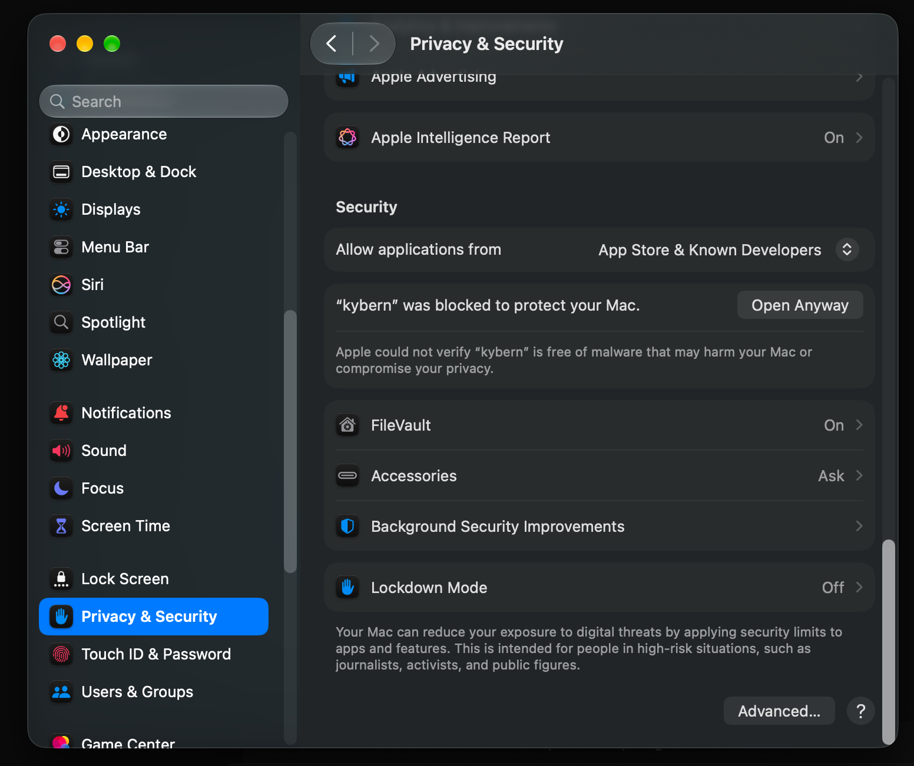
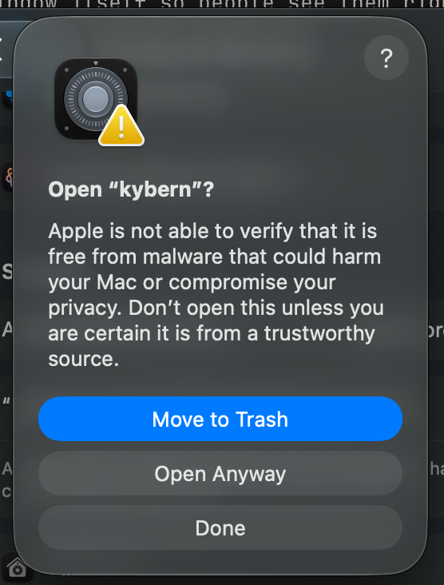

# kybern

A desktop harness for coding agents. Threads, worktrees, approvals, diffs,
terminals and a file explorer for Claude Code, Codex, OpenCode, pi, Oh My Pi
and Cursor, driven through their own protocols, from one Rust daemon and a
Tauri + React desktop client.

kybern is inspired by [T3 Code](https://github.com/pingdotgg/t3code) and
[Synara](https://github.com/Emanuele-web04/synara), with a Rust daemon on
each host. Desktop and mobile clients connect to a selected machine, which
keeps its own projects, threads, and running agents.

## Layout

| Path | What it is |
| --- | --- |
| `crates/kybern-protocol` | Wire types. JSON-RPC 2.0 over WebSocket, scoped tokens, the event-sourced thread model. `kybern-schema` dumps JSON Schema for non-Rust clients. |
| `crates/kybern-store` | SQLite persistence (WAL, event log, projections). |
| `crates/kybern-drivers` | One native driver per agent: Claude Code, Codex, OpenCode, pi, Oh My Pi, Cursor. |
| `crates/kybern` | The shipped package: builds the `kybernd` and `kybern` binaries from the two crates below. |
| `crates/kybern-daemon` | `kybernd`. Owns provider processes, threads, approvals, terminals and project files; serves clients on a loopback port with bearer tokens. |
| `crates/kybern-cli` | `kybern`. Command-line client and the integration harness for every driver. |
| `crates/kybern-client` | Shared WebSocket client used by the CLI and the desktop shell. |
| `apps/desktop` | The desktop app: Tauri 2 shell (`src-tauri`, crate `kybern-desktop`) around a React 19 + Tailwind 4 web app. Bundles and spawns `kybernd` if none is running. |
| `apps/mobile` | Expo client (connect, threads, transcript, approvals, composer). |

The previous GPUI desktop client lives on the `gpui` branch and is no longer
built from `main`.

## Install

Choose what this machine will do:

| Machine | Install |
| --- | --- |
| Your Mac, Windows PC, or Linux desktop | Desktop app. It bundles the local daemon. |
| VPS or another machine that runs agents | `kybernd` only; optionally `kybern` for administration over SSH. No desktop, Node, or pnpm required. |
| Phone | The mobile companion is still a source-only scaffold; see [apps/mobile](apps/mobile/README.md). |

Install and authenticate your coding-agent CLIs on the machine that will run
work. A VPS keeps its own projects, threads and provider credentials; connecting
to it does not copy your laptop's projects or credentials.

### Desktop app

Every desktop package bundles `kybernd`; you do not need to install the daemon
or CLI separately on a desktop.

**macOS**, two ways. The quickest is one command, which installs the app into
Applications and opens it with no prompt:

```sh
curl -fsSL https://github.com/Tresnanda/kybern/releases/latest/download/kybern-mac-install.sh | sh
```

Or download the DMG from the
[release page](https://github.com/Tresnanda/kybern/releases/latest) and drag
kybern into Applications. Kybern is not notarized by Apple, so the first launch
of a browser download is blocked with "Apple could not verify kybern is free of
malware". Allow it once:

1. Click **Done** on that dialog (not Move to Trash).
2. Open **System Settings → Privacy & Security** and scroll to the **Security**
   section. Click **Open Anyway** next to "kybern was blocked to protect your
   Mac".

   

3. Confirm with **Open Anyway** on the next dialog and enter your password or
   Touch ID.

   

That is a one-time step. Updates installed by the app itself are never blocked,
and neither is the command above, because only browser downloads are marked for
this check.

**Linux and Windows**: download from the release page.

| Platform | Asset |
| --- | --- |
| macOS, Apple silicon | `kybern-<version>-aarch64-apple-darwin.dmg` |
| macOS, Intel | `kybern-<version>-x86_64-apple-darwin.dmg` |
| Linux x86_64 | `kybern-<version>-x86_64-unknown-linux-gnu.AppImage` or `.deb` |
| Windows x86_64 | `kybern-<version>-x86_64-pc-windows-msvc-setup.exe` |

The app checks the release feed after launch and every few hours, and offers
to install a newer version; **Settings → About** has a manual check. Installing
an update restarts the app and its local daemon, so agents running on that
machine restart with it. Remote environments are unaffected.

To build from source instead, install stable Rust, Node 22+, pnpm 11, and the
[Tauri platform prerequisites](https://v2.tauri.app/start/prerequisites/), then:

```sh
git clone https://github.com/Tresnanda/kybern.git
cd kybern/apps/desktop
pnpm install --frozen-lockfile
pnpm tauri build
```

The package lands under `target/release/bundle/` at the repository root. Source
builds do not self-update.

### Daemon only: VPS or remote machine

The easiest path needs nothing on the machine but SSH access: in the desktop
app choose **Switch environment → Add environment → Over SSH**, enter
`user@host`, and Kybern installs the daemon, starts it, and pairs through a
tunnel it manages.

To set the machine up yourself instead, one command installs the daemon and the `kybern` CLI into `~/.cargo/bin`
without Rust, Node or a desktop. Add `--service` on a Linux machine with systemd
to keep the daemon running as a user service:

```sh
curl --proto '=https' --tlsv1.2 -LsSf \
  https://github.com/Tresnanda/kybern/releases/latest/download/kybern-remote-install.sh | sh -s -- --service
```

Other options: `--version 0.2.0` pins a release, `--port` and `--bind` set the
service's listener (default `127.0.0.1:4173`).

A remote daemon updates itself: **Settings → Agents → Updates** on the desktop
shows its version, checks the release feed, and installs the newest version
once nothing is running, restarting it under its service manager. Turn on
**Update the daemon automatically** there for a daily check. The same is
available headless as `kybern daemon-update --check` and `--run`. The release page also has
`kybern-installer.sh`, its PowerShell twin, and one `kybern-<target>` archive
per platform holding both binaries: macOS (Apple silicon/Intel), Linux
(x86_64/arm64 musl) and Windows (x86_64). Run the installer again to upgrade.

From a checkout, `cargo install --locked --path crates/kybern` builds the same
binaries with stable Rust and your platform's native build tools.

#### Connect over Tailscale

With Tailscale installed and connected on the VPS and your desktop or phone,
the quickest route is to let the daemon listen on its Tailscale address:

```sh
kybern pair --tailscale
```

This opens a listener on the VPS's Tailscale IP next to the loopback one,
remembers the choice in `settings.json` (`access.tailscale`), and prints a QR
code the Kybern mobile app can scan. The desktop app offers the same switch,
**Reachable over Tailscale**, in **Pair a device**. Traffic stays inside the
tailnet's WireGuard tunnel; nothing is exposed on the public interface.

For a browser-friendly HTTPS address instead, configure
[Tailscale Serve](https://tailscale.com/docs/reference/tailscale-cli/serve)
on the VPS to forward to Kybern:

```sh
tailscale serve --bg http://127.0.0.1:4173
kybernd --port 4173 --pair
```

`kybernd --pair` starts the daemon and prints:

- A six-digit pairing code, valid once for ten minutes.
- A QR code of the invitation when a reachable address was detected.
- Detected addresses, including a matching Tailscale HTTPS proxy when configured.
- A complete invitation for each address, containing the code and environment identity.

In the desktop app, choose **Switch environment → Add environment**, enter a
name, and paste the complete invitation into **Address or pairing invitation**.
You can also enter its address and code separately. Keep the daemon running.
Create a separate code for each client.

If the daemon is already running, generate a new invitation over SSH with:

```sh
kybern pair
```

Do not start a second daemon against the same data directory. If you installed
only `kybernd`, its `--pair` option is for startup; use the optional CLI to pair
more devices while work stays running.

Discovery checks active network interfaces and the installed Tailscale CLI.
It prefers a matching HTTPS Serve proxy, and lists direct Tailscale, private,
and public interface addresses only when the daemon listens on them. It never
opens a firewall, enables Serve, or guesses that a public NAT address accepts
inbound connections. With the default loopback listener and no proxy, it prints
local-only addresses and tells you to run `kybern pair --tailscale` or
configure a proxy or SSH tunnel.

#### Connect through an SSH tunnel or another HTTPS proxy

For an SSH tunnel, start the daemon on the VPS:

```sh
kybernd --port 4173 --pair
```

On your desktop, keep this tunnel running:

```sh
ssh -N -L 14173:127.0.0.1:4173 user@your-vps
```

Use **http://127.0.0.1:14173** and the code printed on the VPS. The tunnel's
local port belongs to your desktop, so use that address instead of the VPS's
printed loopback address. A phone needs its own reachable route; it cannot use
a tunnel running only on your desktop.

For an existing HTTPS reverse proxy, supply its public address explicitly:

```sh
kybernd --port 4173 --advertise-url https://kybern.example.com --pair
```

This advertises the URL; it does not configure the proxy or TLS.

## Build from source

Needs stable Rust 1.88 or newer (`rust-toolchain.toml` picks it up), Node 22
and pnpm 11 (`corepack enable`).

```sh
cargo build --release -p kybern   # target/release/{kybernd,kybern}

cd apps/desktop
pnpm install --frozen-lockfile
pnpm tauri build                                        # builds and bundles kybernd automatically
```

The `pnpm tauri` wrapper builds the daemon for the same profile and target,
stages the target-triple sidecar expected by Tauri, and then runs the Tauri
CLI. The standalone daemon and CLI builds remain available for headless and
remote use.

To connect to another machine, use the desktop environment menu. Each machine
keeps its own projects and running work.

For development, run the web app with hot reload inside the Tauri window:

```sh
cd apps/desktop && pnpm tauri dev
```

The desktop app reuses an authenticated, protocol-compatible daemon selected
by `KYBERN_DATA_DIR`. If none is available it starts the bundled daemon on an
unused port, writes that port to `daemon.port`, and leaves the daemon running
for CLI and mobile clients when the window closes.

For app-managed local endpoints, reopening the desktop automatically replaces a
daemon when the staged binary is newer or incompatible. A daemon selected with
`KYBERN_URL` is externally managed and is never stopped automatically. Note that
`pnpm build` builds only the React frontend; use the Tauri wrapper to build and
stage daemon or driver changes as well: `pnpm tauri dev` or `pnpm tauri build`.

### macOS app bundle

`scripts/bundle-macos.sh` runs the self-contained `pnpm tauri build`, verifies
the bundled daemon, signs the app ad hoc, and writes
`dist/kybern-<version>-<arch>-apple-darwin.dmg`:

```sh
scripts/bundle-macos.sh              # SKIP_BUILD=1 reuses the last complete app
```

It needs Xcode command line tools (`codesign`, `hdiutil`), Node 22 and pnpm.

### Releasing

Tagging `vX.Y.Z` runs `.github/workflows/release.yml` (generated by
`dist generate` from `dist-workspace.toml`): it builds the daemon and CLI for
every target, publishes archives + installers to a GitHub Release, and then
runs `.github/workflows/macos-app.yml`, which builds the DMG with the bundle
script on macOS runners and uploads it to the same release. Run
`dist plan` locally to check the config after editing it, and `dist generate`
to refresh `release.yml`.

## Run it

```sh
cargo build
./target/debug/kybernd                       # data in ~/.kybern, port 4173
./target/debug/kybern providers
./target/debug/kybern new -p . "explain this repo in three lines"
./target/debug/kybern threads
./target/debug/kybern send <thread-id> "now write the README"
./target/debug/kybern watch                  # live event stream for all threads
./target/debug/kybern ls <project-id> src    # browse project files
./target/debug/kybern terminal run <thread-id> "git status"
```

Approvals show up inline in `new` and `send`; answer with `y`, `a` (always) or `n`.

### Background behaviour

The daemon outlives the app, so it trims what it keeps alive once work
finishes. Agent processes are resumed from the provider's own session on the
next message, so releasing one loses no conversation. Limits live under
`background` in `settings.json` (also in Settings > General > Background);
every value is in minutes and `0` turns that limit off.

| Setting | Default | What it does |
| --- | --- | --- |
| `session_idle_minutes` | 10 | Close an idle thread's agent process after this long. Running, awaiting-approval, and background-task threads are never touched. |
| `max_idle_sessions` | 4 | Most idle agent processes kept warm; the least recently used go first. |
| `terminal_idle_minutes` | 60 | Close shells with no window attached and nothing in the foreground. |
| `daemon_idle_exit_minutes` | 0 (off) | Exit the daemon after nothing has needed it. Only for daemons the desktop app starts on demand; the CLI and remote clients do not restart an exited daemon. |

`kybern activity` shows what the daemon is holding open right now: clients,
agent processes (live and idle), terminals, queued follow-ups, and when it
would exit if idle exit is on.

## Status

What works today, all verified end to end on macOS:

- **Daemon**: WebSocket JSON-RPC with scoped tokens, SQLite event log with
  replay, per-turn git checkpoints, turn and thread diffs, workspace revert
  and conversation rewind, server-owned terminals, project file listing and
  reading, pairing codes for other devices, attachment uploads, settings and
  keybindings files.
- **Agents**: Claude Code, Codex, OpenCode, Oh My Pi, and Cursor drive
  through their native protocols with streaming, tool calls, approvals,
  resume, and model switching. pi is wired but untested here.
- **Desktop**: projects and threads in a translucent sidebar, a streaming
  transcript with a message rail, "Worked for" disclosures and inline diffs,
  a frosted composer with @ file mentions, / commands, queued follow-ups,
  approval cards answered by digit, permission mode and model/effort pickers,
  hand-off between agents, a right dock with diff, terminal tabs (shells and
  agent CLIs side by side) and a file explorer, an Environment card, a pull
  request list, a command palette, settings, light and dark themes, and
  resizable panes.
- **CLI**: everything the daemon does, usable from scripts.
- **Mobile**: Expo client scaffold in `apps/mobile`. Not yet run on a device.

## License

MIT.
